## Решение задания

1. Используя команду cat в терминале операционной системы Linux, создать
 два файла Домашние животные (заполнив файл собаками, кошками, хомяками) и Вьючные животными заполнив файл Лошадьми, верблюдами и ослы), а затем объединить их. Просмотреть содержимое созданного файла.

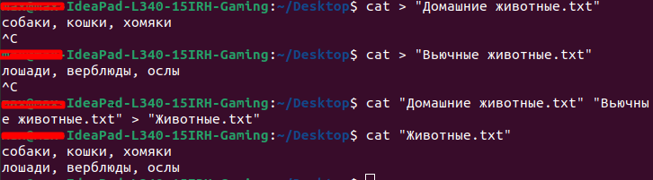

2. Переименовать файл, дав ему новое имя (Друзья человека).

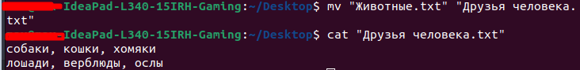

3. Создать директорию, переместить файл туда.

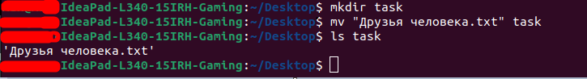

4. Подключить дополнительный репозиторий MySQL. Установить любой пакет из этого репозитория.

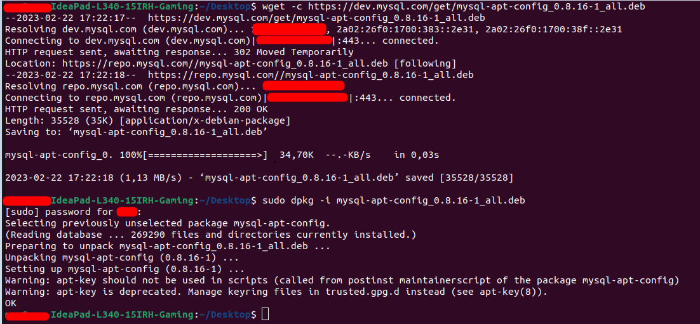

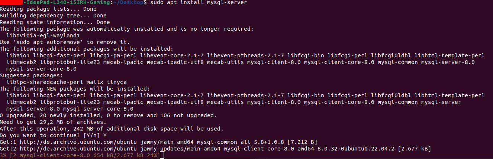

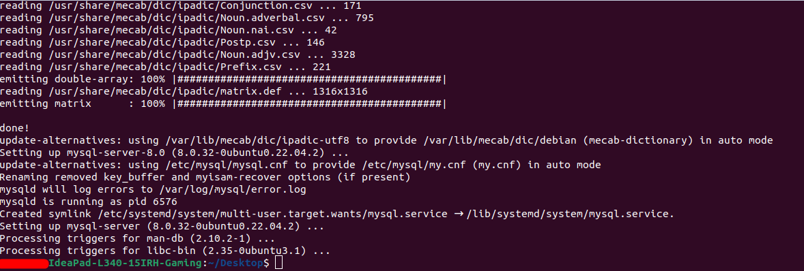

5. Установить и удалить deb-пакет с помощью dpkg.

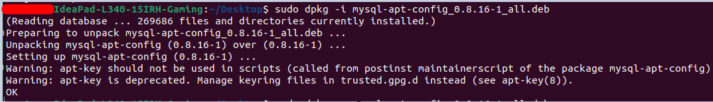

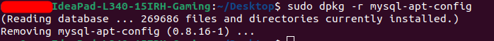

6. Выложить историю команд в терминале ubuntu

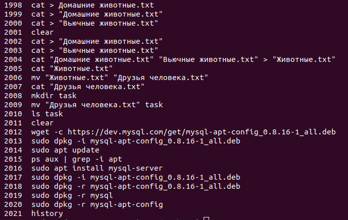

7. Нарисовать диаграмму, в которой есть класс родительский класс, домашние
 животные и вьючные животные, в составы которых в случае домашних животных войдут классы: собаки, кошки, хомяки, а в класс вьючные животные войдут: Лошади, верблюды и ослы).

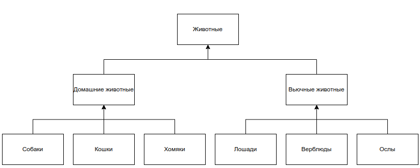

8. В подключенном MySQL репозитории создать базу данных “Друзья человека”

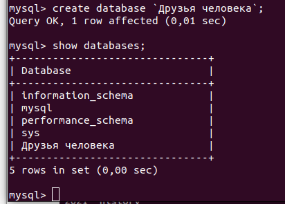

9. Создать таблицы с иерархией из диаграммы в БД

`Таблица «Животные»`
```sql
CREATE TABLE animals (
  id INT PRIMARY KEY,
  name VARCHAR(50) NOT NULL,
  species VARCHAR(50) NOT NULL,
  habitat VARCHAR(50) NOT NULL,
  age INT,
  brirthday VARCHAR(50)
);
```

`Таблица «Домашние животные»`
```sql
CREATE TABLE home_animals (
  id INT PRIMARY KEY,
  command VARCHAR(50) NOT NULL,
  FOREIGN KEY (id) REFERENCES animals(id)
);
```

`Таблица «Вьючные животные»`
```sql
CREATE TABLE work_animals (
  id INT PRIMARY KEY,
  command VARCHAR(50) NOT NULL,
  FOREIGN KEY (id) REFERENCES animals(id)
);
```

10. Заполнить низкоуровневые таблицы именами(животных), командами которые они выполняют и датами рождения

```sql
INSERT INTO animals (id, name, species, habitat, age, birthday) VALUES
  (1, 'Собака', 'Canis lupus familiaris', 'Дом', 2, '01.05.2019'),
  (2, 'Кошка', 'Felis catus', 'Дом', 4, '01.06.2017'),
  (3, 'Хомяк', 'Cricetinae', 'Дом', 1, '01.07.2022'),
  (4, 'Лошадь', 'Equus ferus caballus', 'Ферма', 5, '01.08.2016'),
  (5, 'Верблюд', 'Camelus', 'Пустыня', 3, '01.09.2018'),
  (6, 'Осел', 'Equus africanus asinus', 'Ферма', 7, '01.10.2014');

INSERT INTO home_animals (id, command) VALUES
  (1, 'Сидеть'),
  (2, 'Ловить мышей'),
  (3, 'Крутиться в колесе');

INSERT INTO work_animals (id, command) VALUES
  (4, 'Тянуть плуг'),
  (5, 'Нести грузы'),
  (6, 'Тянуть телегу');
```

11. Удалив из таблицы верблюдов, т.к. верблюдов решили перевезти в другой питомник на зимовку. Объединить таблицы лошади, и ослы в одну таблицу.

```sql
DELETE FROM animals WHERE (species = «Camelus»);
```

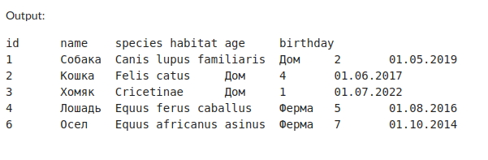

```sql
CREATE TABLE horses_and_donkeys AS
SELECT * from animals where species="Equus ferus caballus" or species="Equus africanus asinus"
```

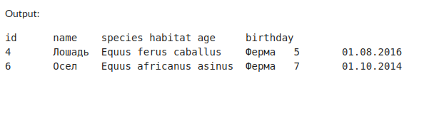

12. Создать новую таблицу “молодые животные” в которую попадут все животные старше 1 года, но младше 3 лет и в отдельном столбце с точностью до месяца подсчитать возраст животных в новой таблице

```sql
CREATE TABLE young_animals AS
SELECT id, name, species, habitat, age,
  DATE_FORMAT(NOW(), '%Y') - DATE_FORMAT(birthday, '%Y') - (DATE_FORMAT(NOW(), '00-%m-%d') < DATE_FORMAT(birthday, '00-%m-%d')) AS years,
  PERIOD_DIFF(DATE_FORMAT(NOW(), '%Y%m'), DATE_FORMAT(birthday, '%Y%m')) AS months
FROM animals
WHERE age > 1 AND age < 3;
```

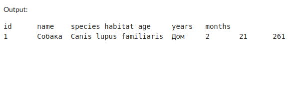

13. Объединить все таблицы в одну, при этом сохраняя поля, указывающие на прошлую принадлежность к старым таблицам.

```sql
SELECT a.*, ha.command AS home_command, wa.command AS work_command, ya.years, ya.months
FROM animals a
LEFT JOIN home_animals ha ON a.id = ha.id
LEFT JOIN work_animals wa ON a.id = wa.id
LEFT JOIN young_animals ya ON a.id = ya.id
UNION
SELECT NULL, NULL, NULL, NULL, NULL, id, command, NULL, NULL
FROM home_animals
UNION
SELECT NULL, NULL, NULL, NULL, NULL, id, NULL, command, NULL
FROM work_animals
UNION
SELECT NULL, NULL, NULL, NULL, age, id, NULL, NULL, CONCAT(years, ' лет ', months, ' мес.') AS age
FROM young_animals;
```

14. Создать класс с Инкапсуляцией методов и наследованием по диаграмме.

```python
class Animal:
    def __init__(self, name, species):
        self.name = name
        self.species = species


class Pet(Animal):
    def __init__(self, name, species, commands=None):
        super().__init__(name, species)
        self.commands = [] if commands is None else commands

    def add_command(self, command):
        self.commands.append(command)

    def list_commands(self):
        print(f"{self.name} the {self.species} knows the following commands:")
        for command in self.commands:
            print(f"- {command}")


class DraftAnimal(Animal):
    def __init__(self, name, species, commands=None):
        super().__init__(name, species)
        self.commands = [] if commands is None else commands

    def add_command(self, command):
        self.commands.append(command)

    def list_commands(self):
        print(f"{self.name} the {self.species} can perform the following tasks:")
        for command in self.commands:
            print(f"- {command}")


class Command:
    def __init__(self, name, description):
        self.name = name
        self.description = description
```

15. Написать программу, имитирующую работу реестра домашних животных. В программе должен быть реализован следующий функционал:
- Завести новое животное
- определять животное в правильный класс
- увидеть список команд, которое выполняет животное
- обучить животное новым командам
- Реализовать навигацию по меню

[link to solution](main.py)

16. Создайте класс Счетчик, у которого есть метод add(), увеличивающий̆ значение внутренней̆ int переменной̆ на 1 при нажатии “Завести новое животное” Сделайте так, чтобы с объектом такого типа можно было работать в блоке try-with-resources. Нужно бросить исключение, если работа с объектом типа счетчик была не в ресурсном try и/или ресурс остался открыт. Значение считать в ресурсе try, если при заведении животного заполнены все поля.

```python
class Counter:
    def __init__(self):
        self.count = 0

    def add(self):
        self.count += 1

    def __enter__(self):
        return self

    def __exit__(self, exc_type, exc_val, exc_tb):
        if exc_type is not None or self.count > 0:
            raise RuntimeError("Resource not properly managed")

```

---

### Верное выполнение команд

``` 
Welcome to the Pet Registry
Please select an option:
1. Add a new pet
2. List all pets
3. Exit
Enter your choice: 1
Enter pet name: test
Enter pet species (dog, cat, hamster, horse, camel, or donkey): dog
Commands for test:
test the dog knows the following commands:
Please select an option:
1. Add a new command
2. Back to previous menu
Enter your choice: 1
Enter command name: run
Enter command description: run
Commands for test:
test the dog knows the following commands:
- run
Please select an option:
1. Add a new command
2. Back to previous menu
Enter your choice: 2
Welcome to the Pet Registry
Please select an option:
1. Add a new pet
2. List all pets
3. Exit
Enter your choice: 2
All pets in the registry:
test the dog (pet)
Welcome to the Pet Registry
Please select an option:
1. Add a new pet
2. List all pets
3. Exit
Enter your choice: 3

Process finished with exit code 0
```

### Выполнение команд при неверном вводе

``` 
Welcome to the Pet Registry
Please select an option:
1. Add a new pet
2. List all pets
3. Exit
Enter your choice: 2
All pets in the registry:
Welcome to the Pet Registry
Please select an option:
1. Add a new pet
2. List all pets
3. Exit
Enter your choice: 1
Enter pet name: r
Enter pet species (dog, cat, hamster, horse, camel, or donkey): g
Invalid species. Please try again.
Welcome to the Pet Registry
Please select an option:
1. Add a new pet
2. List all pets
3. Exit
Enter your choice: 2
All pets in the registry:
Welcome to the Pet Registry
Please select an option:
1. Add a new pet
2. List all pets
3. Exit
Enter your choice: 3

Process finished with exit code 0
```